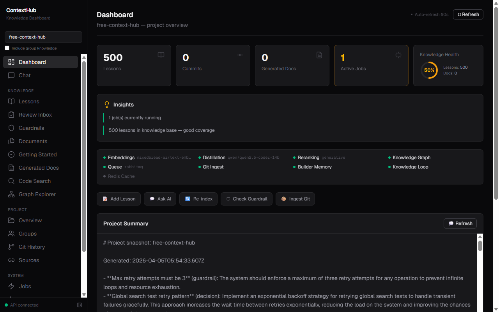
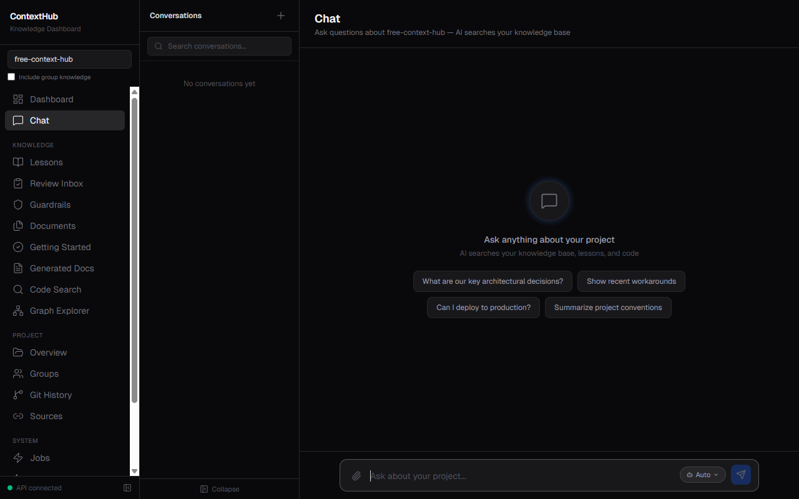
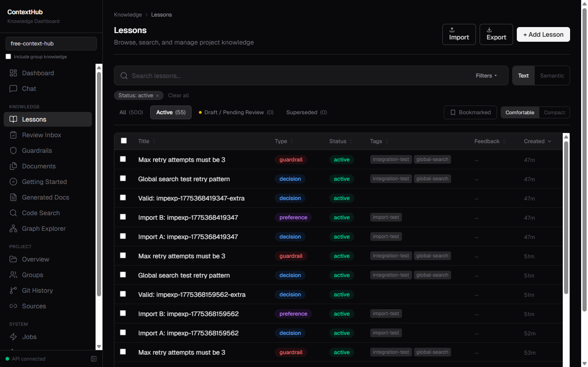
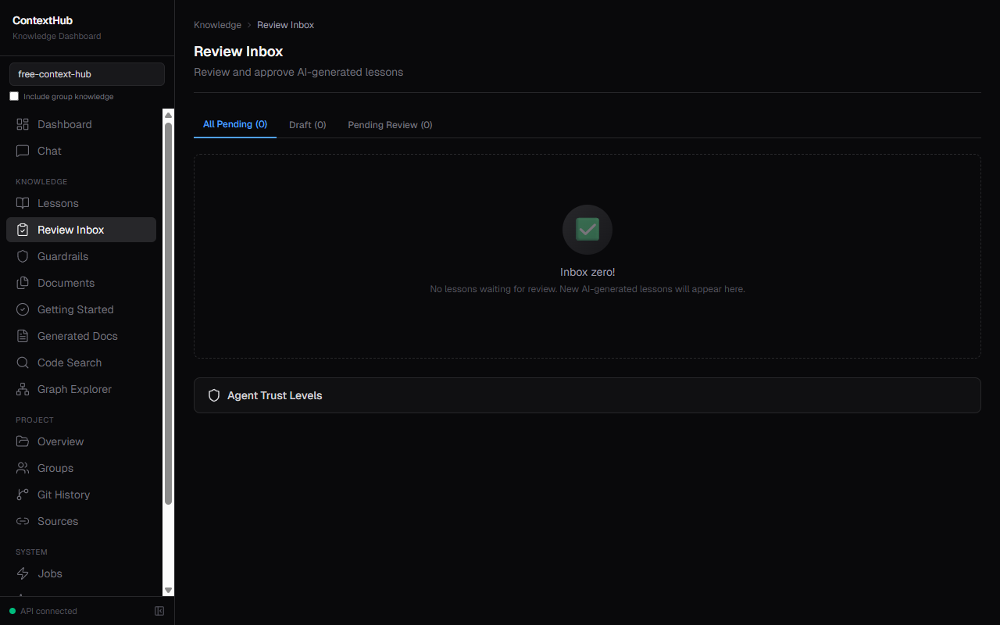
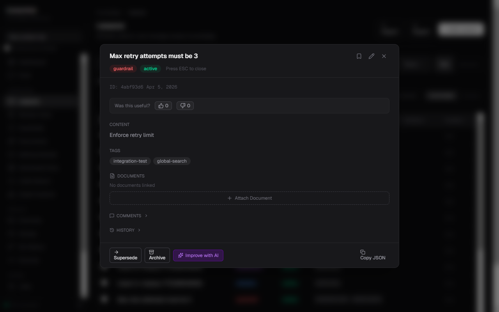
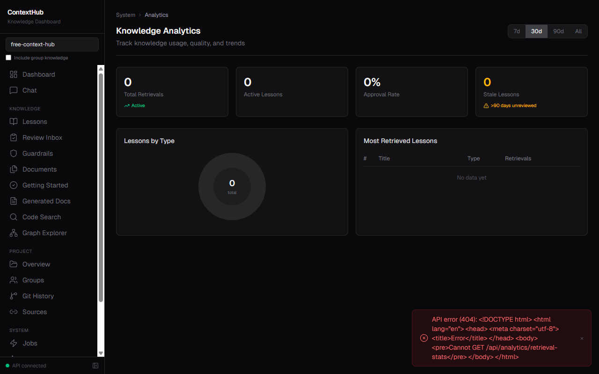
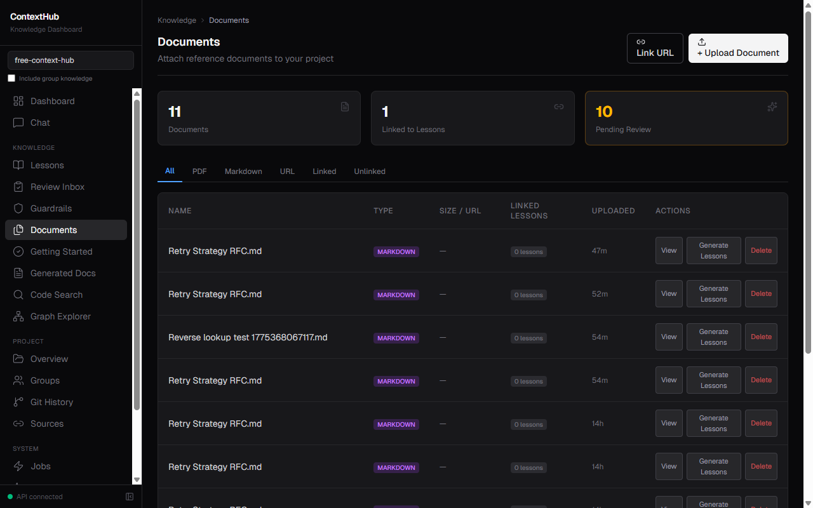
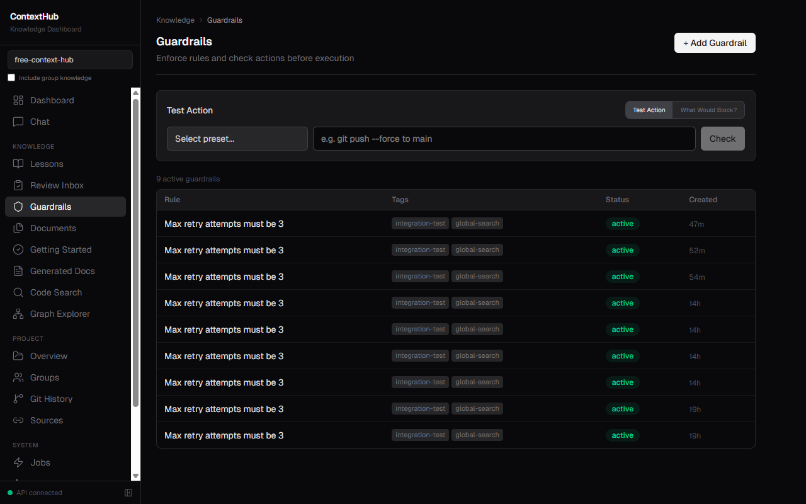

# free-context-hub

> **Self-hosted persistent memory + guardrails for AI coding agents. Free, local, for small teams.**

free-context-hub is a local [ContextStream](https://contextstream.io/)-inspired MCP server that gives your AI assistants (Claude Code, Cursor, etc.) **persistent knowledge across sessions and agents** — decisions, preferences, workarounds, and guardrails that survive after a conversation ends.

It also provides a **web GUI** for humans to review, approve, and refine AI-generated knowledge — bridging **AI-to-AI** and **AI-to-Human** collaboration.

---

## Screenshots (Draft Design)

> Phase 7 GUI complete — 20 pages, 28+ REST endpoints, full human-in-the-loop workflow.

### Dashboard — Knowledge health, insights, activity feed


### AI Chat — Markdown rendering, tool calls, conversation history


### Lessons — Search, filter, import/export, feedback signals


### Review Inbox — Approve AI-generated lessons, trust levels


### Lesson Detail — AI-assisted editor, comments, version history


### Analytics — Retrieval trends, dead knowledge, agent activity


### Documents — Upload, link, generate lessons from docs


### Guardrails — Test presets, "What Would Block?" simulate mode


---

## Why This Exists

Every new AI agent session starts from zero. The agent doesn't know:
- Why your team chose JWT over sessions
- That Redis cache must be flushed after deployment
- That pushing without tests broke production last month
- Your team's naming conventions and architectural preferences

**free-context-hub solves this.** One agent captures a lesson, every future agent benefits — across sessions, across team members, persistently.

---

## Core Features (Priority Order)

### 1. Persistent Lessons & Knowledge (Primary)
The main value proposition. Store and retrieve team knowledge that persists across sessions and agents.

- **`add_lesson`** — Capture decisions, preferences, workarounds, guardrails
- **`search_lessons`** — Semantic search across all stored knowledge
- **`list_lessons`** — Browse with filters (type, tags, status)
- **`update_lesson_status`** — Lifecycle management (draft → active → superseded → archived)
- **`reflect`** — LLM-synthesized answers from multiple lessons (optional, requires chat model)

**Example workflow:**
```
Agent A (Monday):   add_lesson("We use JWT not sessions — legal requires stateless auth")
Agent B (Thursday): search_lessons("authentication approach") → gets the decision instantly
Agent C (Next month): Doesn't waste time debating sessions vs JWT
```

### 2. Guardrails (Primary)
Prevent repeated mistakes by enforcing team rules before risky actions.

- **`check_guardrails`** — Pre-action safety verification (git push, deploy, migrations)
- Guardrails are derived from lessons with `lesson_type: "guardrail"`
- Returns `pass/fail` + prompt for user confirmation when blocked

### 3. Session Bootstrap (Primary)
Quick onboarding for new agent sessions.

- **`get_context`** — Bootstrap with project state + suggested next calls
- **`get_project_summary`** — Full project briefing in one read
- **`help`** — Tool discovery and sample workflows

### 4. Code Search (Supplementary)
Semantic code search assists agents in finding relevant code. This is a **supplementary feature**, not the core goal — agents already have built-in tools (Grep, Glob, Read) for code navigation.

- **`search_code_tiered`** — Multi-tier search with 3 auto-selected profiles:
  - *code-search*: ripgrep > symbol > FTS > semantic (for source/config/types)
  - *relationship*: convention paths > KG imports > filtered ripgrep (for tests)
  - *semantic-first*: vector similarity > FTS (for docs/scripts)
- **`search_code`** — Legacy semantic-only search
- **`index_project`** — Index repository into chunks + embeddings

### 5. Git Intelligence (Supplementary)
Auto-collect insights from commit history.

- **`ingest_git_history`** / **`suggest_lessons_from_commits`** — Draft lessons from git history
- **`analyze_commit_impact`** — Commit impact over symbol/lesson graph

### 6. Knowledge Graph (Optional)
Symbol-level code structure for advanced queries. Requires Neo4j.

- **`search_symbols`** / **`get_symbol_neighbors`** / **`trace_dependency_path`**
- **`get_lesson_impact`** — Which code does a lesson affect?

---

## Quickstart (Run Locally)

1.  **Configure Environment**:
    ```bash
    copy .env.example .env
    ```
2.  **Start Infrastructure**:
    ```bash
    docker compose up -d
    ```
    *(Requires Docker for Postgres + pgvector)*
3.  **Start Embeddings Server**:
    Ensure [LM Studio](https://lmstudio.ai/) or a compatible server is running and serving `POST /v1/embeddings`.
4.  **Launch ContextHub**:
    ```bash
    npm install
    npm run dev
    ```
5.  **Verify Setup**:
    ```bash
    npm run smoke-test
    ```
6.  **Connect Your AI Tool**:
    Add the MCP server URL in your tool's settings: `http://localhost:3000/mcp`.

Detailed setup: [`docs/QUICKSTART.md`](docs/QUICKSTART.md)

---

## Self-Hosted Models

ContextHub uses OpenAI-compatible APIs. Run locally with [LM Studio](https://lmstudio.ai/) or any compatible server.

### Recommended Combo (benchmarked)

We tested 8 embedding models and 8 reranker models ([full benchmark](docs/benchmarks/2026-03-28-embedding-model-benchmark.md)). Best combo:

| Role | Model | Config |
| :--- | :--- | :--- |
| **Embeddings** | `qwen3-embedding-0.6b` | `EMBEDDINGS_DIM=1024` — best accuracy (18/18 pass, avg 0.652) |
| **Reranker** | `qwen3-4b-instruct-ranker` | `RERANK_MODEL=qwen3-4b-instruct-ranker` — +9% accuracy at 180 lessons |
| **Distillation** | `qwen2.5-coder-7b-instruct` | `DISTILLATION_ENABLED=true` — reflect, compress, summarize |

### Alternative Models

**Embedding** (8 tested, lesson search accuracy):

| Model | Dims | Pass Rate | Avg Score | Notes |
| :--- | :--- | :--- | :--- | :--- |
| **qwen3-embedding-0.6b** | 1024 | 18/18 | 0.652 | Recommended |
| bge-m3 | 1024 | 18/18 | 0.575 | Fast, solid all-rounder |
| mxbai-embed-large-v1 | 1024 | 17/18 | 0.648 | Close but 1 failure |

**Reranker** (8 tested, 180 lessons / 33 queries):

| Model | Type | Pass Rate | Latency | Notes |
| :--- | :--- | :--- | :--- | :--- |
| **qwen3-4b-instruct-ranker** | generative | 85% | 1.8s | Recommended — no thinking overhead |
| qwen.qwen3-reranker-4b | generative | 85% | 1.9s | Thinking mode, same accuracy |
| rank_zephyr_7b | generative | 82% | ~2s | RankGPT format |
| (no rerank) | — | 76% | 99ms | Baseline |

> **Note:** Code search uses ripgrep/FTS (deterministic), not embeddings. Cross-encoder rerankers (bge-reranker, gte-reranker) don't work via LM Studio — they need a dedicated `/v1/rerank` API.

---

## Roadmap

**Completed:**
- [x] **Phase 1-2**: Core MVP — Lessons, Search, Guardrails
- [x] **Phase 3**: Knowledge Distillation & Reflection
- [x] **Phase 4**: Knowledge Graph (Neo4j, symbol-level)
- [x] **Phase 5**: Git Intelligence & Automation
- [x] **Phase 6**: Retrieval Quality Tuning & Tiered Search
- [x] **Phase 7**: Interactive GUI & Human-in-the-Loop — 20 pages, 28+ REST endpoints
  - [x] **7.1**: Foundation — Lucide icons, breadcrumbs, animations, pagination, keyboard shortcuts overlay
  - [x] **7.2**: Lesson editing — version history (view/restore), review inbox (batch approve/reject), status tabs
  - [x] **7.3**: AI-assisted features — markdown rendering (syntax highlight), chat history sidebar, create lesson from chat, pinned messages, AI editor (Clarify/Simplify/Expand/Custom + diff view with accept/reject)
  - [x] **7.4**: Documents — upload/link, viewer with in-doc search, AI lesson generation, linked docs in lesson detail
  - [x] **7.5**: Collaboration — threaded comments, feedback (thumbs up/down), bookmarks, import/export (JSON)
  - [x] **7.6**: Observability — activity timeline, analytics (donut chart, dead knowledge, agent activity), getting started (learning path), dashboard insights (health score ring)
  - [x] **7.7**: Polish — global search Cmd+K, agent trust levels, responsive sidebar, notification settings persistence, feedback column in lessons table

**Planned:**
- [ ] **Phase 8**: Advanced HITL — access control (roles/permissions), custom lesson types/templates, rich content editor, agent audit trail
- [ ] **Phase 9**: Multi-format Ingestion — PDF/DOCX/image parsing pipelines (document foundation from Phase 7)
- [ ] **Phase 10**: Knowledge Portability — cross-instance sync, exchange hub (basic import/export done in Phase 7)

**Dropped:**
- ~~Multi-Agent Passive Collection~~ — Parsing agent conversations costs tokens (contradicts "reduce token usage" goal), most conversation is noise, `add_lesson` captures verified conclusions explicitly.
- ~~Session History Sharing~~ — Transcripts are 50k-200k tokens. The value is conclusions, not the journey. `add_lesson` captures those in ~100 tokens.
- ~~IDE Native (VS Code extension)~~ — Agents use MCP (done). Humans need a UI, but a web dashboard (Phase 7) works in any browser including VS Code's built-in browser — same reach, fraction of the effort.

---

## Troubleshooting

- **`Unauthorized: invalid workspace_token`**: Set `MCP_AUTH_ENABLED=false` in `.env` or provide the correct token.
- **`dimension mismatch`**: Ensure `EMBEDDINGS_DIM=1024` matches your model's output.
- **`401 Unauthorized` (LM Studio)**: Check `EMBEDDINGS_API_KEY` in your `.env`.

---

MIT License | [Whitepaper](WHITEPAPER.md) | [Agent Protocol](AGENT_PROTOCOL.md)
